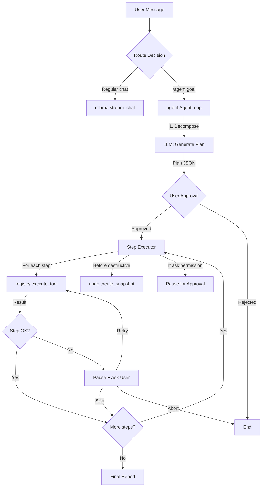
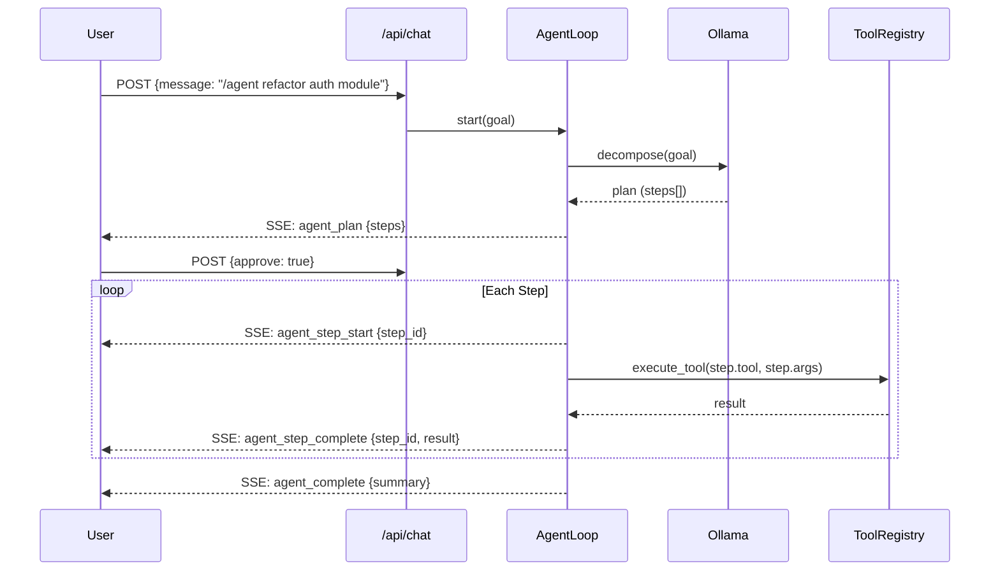
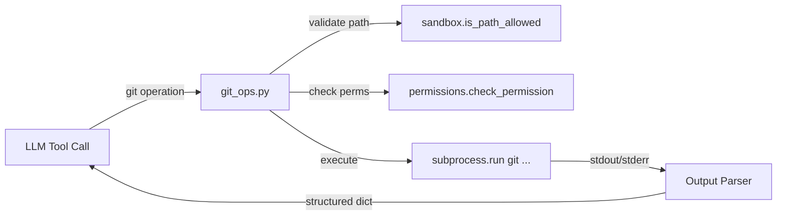
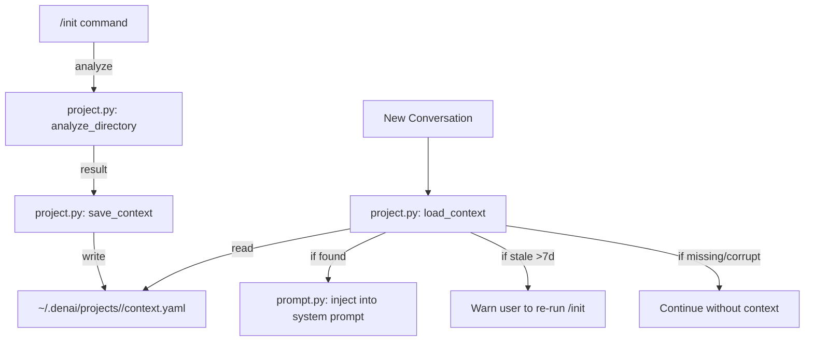
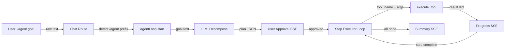
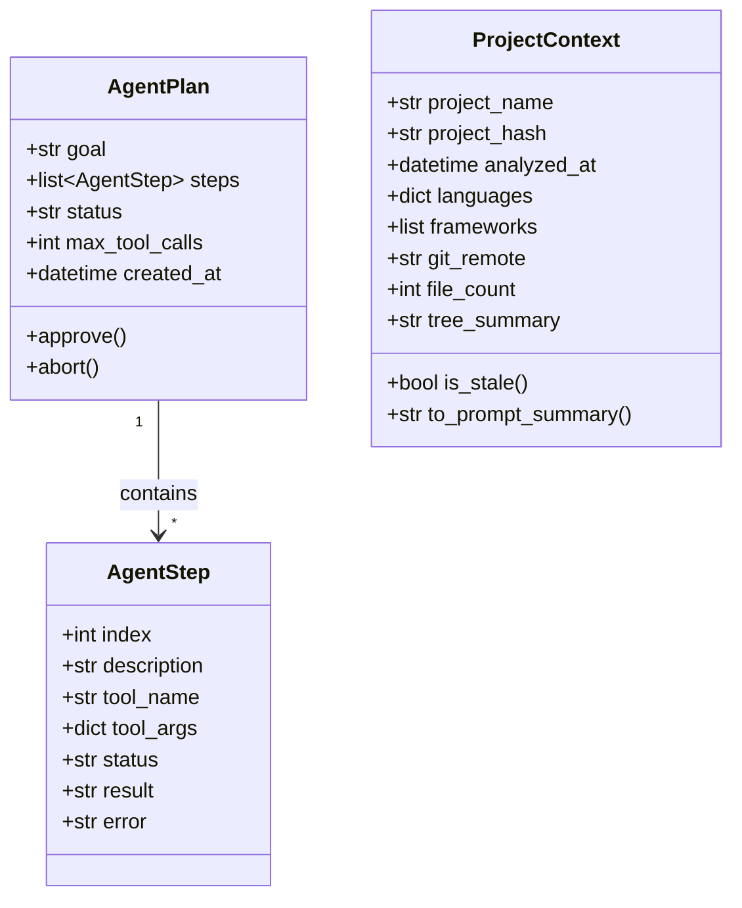

# Design Document

## Overview

### Change Type

new-feature

### Design Goals

1. Introduce an agent loop orchestrator that reuses existing tools, plans, undo, and permissions infrastructure
2. Add a git tool with structured output that integrates seamlessly into the tool registry
3. Persist project analysis results and auto-inject them into the system prompt on session start
4. Maintain backward compatibility — all existing behavior continues unchanged when agent mode is not invoked

### References

- **REQ-1**: Agent Loop Orchestration
- **REQ-2**: Git Integration Tool
- **REQ-3**: Persistent Project Context

---

## System Architecture

### DES-1: Agent Loop Orchestrator

The agent loop is a new module `denai/agent.py` that sits between the chat route and the existing LLM tool-calling loop. When triggered, it uses the LLM to decompose a goal into a plan, then executes each step by invoking the standard `execute_tool()` from the registry. The loop tracks state (pending → in_progress → completed → failed), respects permissions, integrates with undo snapshots, and streams progress via SSE.

The orchestrator does NOT replace the existing chat flow — it augments it. Regular messages continue through `ollama.stream_chat()`. Only `/agent` prefixed messages or explicit agent mode activations enter the agent loop.



_Implements: REQ-1.1, REQ-1.2, REQ-1.3, REQ-1.5, REQ-1.6, REQ-1.8, REQ-1.9_

### DES-2: Agent SSE Progress Streaming

During agent loop execution, progress events are streamed to the frontend through the existing SSE infrastructure used by `stream_chat()`. New event types are introduced: `agent_plan` (plan proposal), `agent_step_start`, `agent_step_complete`, `agent_step_error`, `agent_paused`, `agent_complete`. The frontend can render these as a progress tracker.



_Implements: REQ-1.4, REQ-1.7_

### DES-3: Git Tool

A new tool module `denai/tools/git_ops.py` registered in the tool registry with name `git`. It wraps git CLI commands, parses their output into structured dicts, and applies sandbox validation on the working directory. Write operations (add, commit, checkout, stash) are gated by the permissions system under the tool name `git`.



Supported operations and their return structures:

| Operation | Parameters | Returns |
|-----------|------------|---------|
| `status` | — | `{branch, staged[], unstaged[], untracked[], ahead, behind}` |
| `diff` | `path?`, `ref?` | `{files[{name, added, removed, patch}]}` |
| `log` | `limit?` (default 10) | `{commits[{hash, author, date, message}]}` |
| `branch` | `list?`, `create?`, `delete?` | `{branches[], current}` |
| `add` | `paths[]` | `{added[]}` |
| `commit` | `message` | `{hash, message}` |
| `checkout` | `ref` | `{branch}` |
| `stash` | `action` (push/pop/list) | `{result}` |

_Implements: REQ-2.1, REQ-2.2, REQ-2.3, REQ-2.4, REQ-2.5, REQ-2.6, REQ-2.7, REQ-2.8_

### DES-4: Persistent Project Context

Extends the existing `denai/project.py` module to persist analysis results and injects them into the system prompt via `denai/llm/prompt.py`. A new route `GET /api/project/context` exposes the stored context.



The project hash is computed as `hashlib.sha256(abs_path.encode()).hexdigest()[:12]` — short enough for filesystem friendliness, collision-resistant enough for local use.

Context YAML structure:
```yaml
project_name: denai
analyzed_at: "2026-03-20T17:00:00"
languages:
  Python: 92.3
  JavaScript: 5.1
  HTML: 2.6
frameworks:
  - FastAPI
  - pytest
git_remote: https://github.com/rodrigogobbo/denai.git
file_count: 93
tree_depth_2: |
  denai/
    llm/
    tools/
    routes/
    ...
```

_Implements: REQ-3.1, REQ-3.2, REQ-3.3, REQ-3.4, REQ-3.5, REQ-3.6, REQ-3.7_

---

## Data Flow



---

## Code Anatomy

| File Path | Purpose | Implements |
|-----------|---------|------------|
| `denai/agent.py` | Agent loop orchestrator — plan decomposition, step execution, state management, error handling | DES-1, DES-2 |
| `denai/routes/agent.py` | API routes for agent loop (start, approve, status, abort) | DES-2 |
| `denai/tools/git_ops.py` | Git tool — structured wrappers for git CLI operations | DES-3 |
| `denai/project.py` | Extended — persist/load project context, staleness check | DES-4 |
| `denai/llm/prompt.py` | Extended — inject project context into system prompt | DES-4 |
| `denai/routes/project.py` | Extended — GET /api/project/context endpoint | DES-4 |
| `tests/test_agent.py` | Agent loop tests | DES-1, DES-2 |
| `tests/test_git_ops.py` | Git tool tests | DES-3 |
| `tests/test_project_context.py` | Persistent context tests | DES-4 |

---

## Data Models



---

## Error Handling

| Error Condition | Response | Recovery |
|-----------------|----------|----------|
| LLM fails to decompose goal into valid plan | Return error message asking user to rephrase | Retry with clearer goal |
| Tool execution fails during step | Pause agent loop, report error, offer retry/skip/abort | User chooses action |
| User message received during execution | Pause execution, handle message, offer resume | User decides to resume/abort |
| Git operation on non-git directory | Return structured error with suggestion | User navigates to git repo |
| Git merge conflict during checkout | Return conflict details with file list | User resolves manually |
| Context YAML corrupted/unreadable | Log warning, skip injection | Continue without context |
| Context file older than 7 days | Display notice, continue with stale context | User runs /init |
| Agent loop exceeds 50 tool calls | Abort with progress report | User reviews and restarts with narrower goal |

---

## Impact Analysis

| Affected Area | Impact Level | Notes |
|----------------|---------------|-------|
| `denai/routes/chat.py` | Medium | Add detection for `/agent` prefix to route to agent loop |
| `denai/llm/prompt.py` | Low | Add project context injection block |
| `denai/project.py` | Medium | Add persist/load functions, extend analyze result |
| `denai/routes/project.py` | Low | Add GET /api/project/context endpoint |
| `denai/tools/registry.py` | Low | Auto-register git tool (already supports autodiscovery) |
| `denai/app.py` | Low | Register new agent router |

### Testing Requirements

| Test Type | Coverage Goal | Notes |
|-----------|---------------|-------|
| Unit tests | All agent loop states, git operations, context persistence | pytest, mock subprocess and LLM |
| Integration tests | Agent loop with real tool calls (file_read, file_write) | Use tmp_path, mock LLM responses |

---

## Traceability Matrix

| Design Element | Requirements |
|----------------|--------------|
| DES-1 | REQ-1.1, REQ-1.2, REQ-1.3, REQ-1.5, REQ-1.6, REQ-1.8, REQ-1.9 |
| DES-2 | REQ-1.4, REQ-1.7 |
| DES-3 | REQ-2.1, REQ-2.2, REQ-2.3, REQ-2.4, REQ-2.5, REQ-2.6, REQ-2.7, REQ-2.8 |
| DES-4 | REQ-3.1, REQ-3.2, REQ-3.3, REQ-3.4, REQ-3.5, REQ-3.6, REQ-3.7 |
